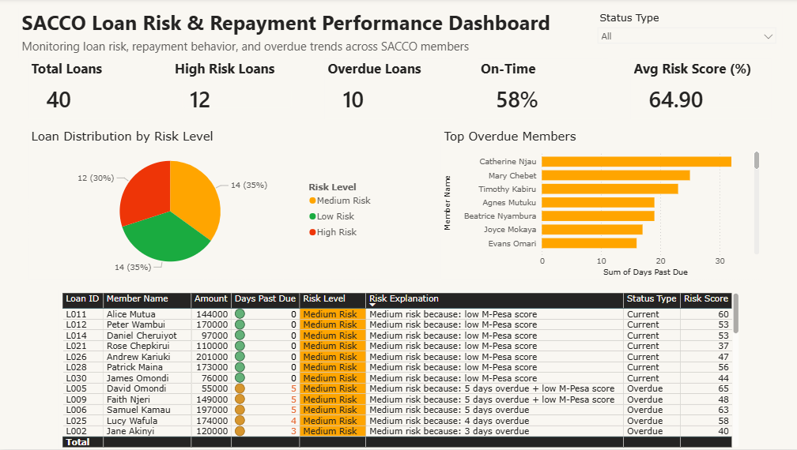
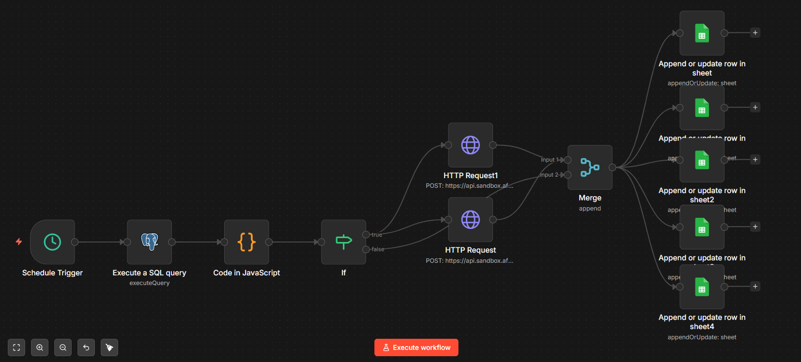
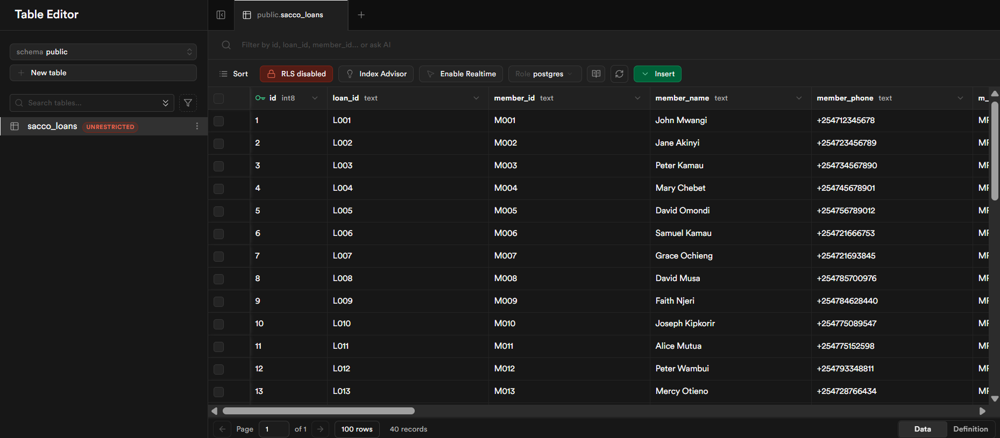
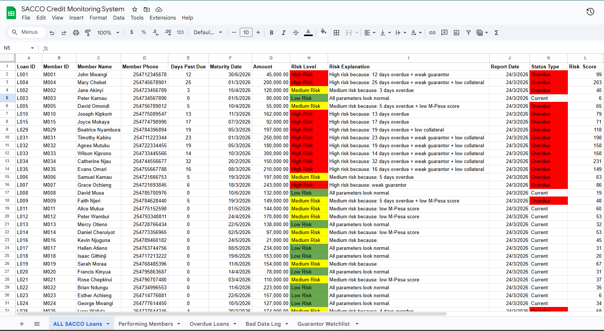
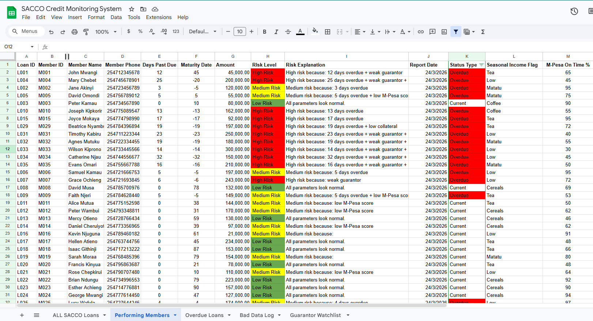
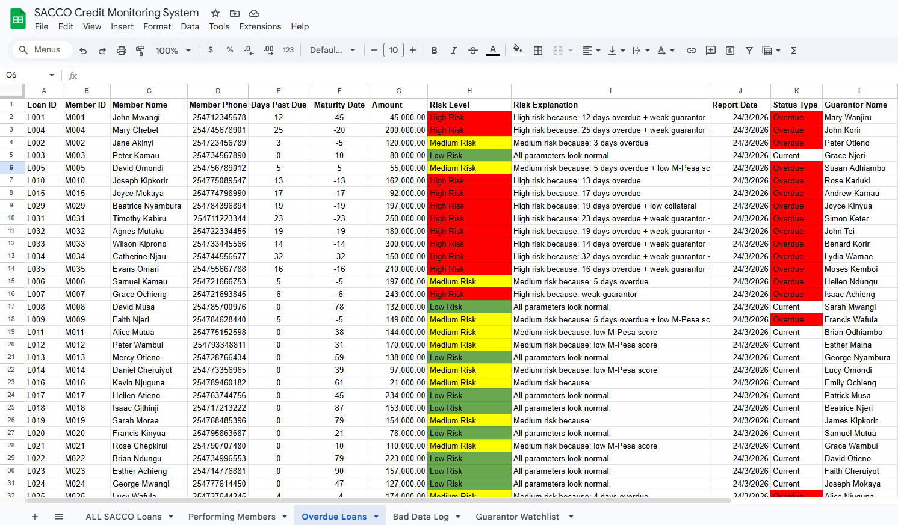
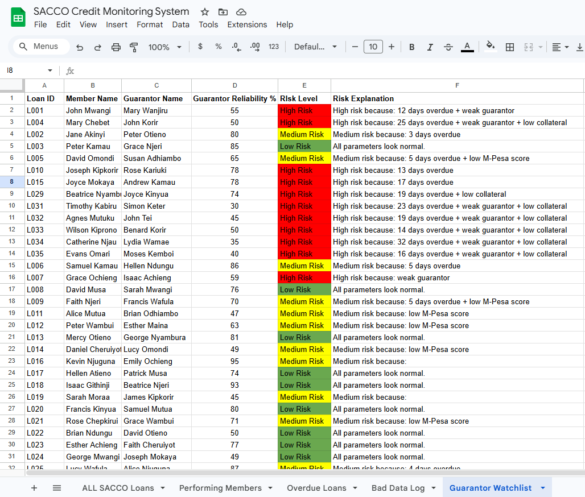

# 📊 SACCO Loan Risk & Repayment Monitoring Dashboard

## 🚀 Project Overview

This project demonstrates an **end-to-end data pipeline and analytics solution** 
for monitoring SACCO loan risk, repayment behavior, and overdue trends across members.

The solution integrates:

* **Supabase (PostgreSQL)** → Data storage
* **n8n** → Workflow automation & business logic
* **Africa's Talking** → SMS alerts for high-risk & overdue loans
* **Google Sheets** → Intermediate structured data layer
* **Power BI** → Data visualization & dashboarding

👉 The goal is to simulate a **real-world financial risk monitoring system** 
suitable for Kenyan SACCOs.

---

## 🧠 Business Problem

SACCOs need to:

* Identify **high-risk borrowers** early
* Monitor **loan repayment performance**
* Detect **overdue loans** before they become bad debts
* Send **timely SMS alerts** to members and officers
* Present **clear dashboards** to the board

This project automates the entire process — from data storage to insights.

---

## ⚙️ Architecture Overview
```
Supabase (PostgreSQL Database)
        ↓
n8n Workflow (Automation + Risk Scoring Logic)
        ↓
Africa's Talking (SMS Alerts)
        ↓
Google Sheets (5 Structured Output Tabs)
        ↓
Power BI Dashboard (Visualization & Reporting)
```

---

## 🛠️ Prerequisites

To replicate this project you will need:

* [Supabase](https://supabase.com) account (free)
* [n8n](https://n8n.io) account (free trial or cloud)
* [Africa's Talking](https://africastalking.com) account (Sandbox for testing)
* Google account (for Google Sheets)
* [Power BI Desktop](https://powerbi.microsoft.com) (free)

---

## 🗄️ 1. Supabase (Database Layer)

### What was done:

* Created a PostgreSQL table: `sacco_loans`
* Defined all key fields for loan monitoring

### Full Table Schema:
```sql
CREATE TABLE IF NOT EXISTS sacco_loans (
    id BIGSERIAL PRIMARY KEY,
    loan_id TEXT,
    member_id TEXT,
    member_name TEXT,
    member_phone TEXT,               -- +2547xxxxxxxx
    m_pesa_reference TEXT,
    guarantor_name TEXT,
    seasonal_income_flag TEXT,       -- Tea, Coffee, Matatu, Low
    amount NUMERIC,
    maturity_date TIMESTAMPTZ,
    days_to_maturity INTEGER,
    days_past_due INTEGER,
    collateral_ratio NUMERIC,
    m_pesa_payments_on_time NUMERIC, -- 0-100
    guarantor_reliability NUMERIC,   -- 0-100
    risk_score NUMERIC,
    risk_level TEXT,                 -- Low/Medium/High Risk
    risk_explanation TEXT,
    risk_status TEXT,
    report_date DATE DEFAULT CURRENT_DATE,
    status_type TEXT                 -- Current or Overdue
);
```

### Data:

* Sample loan data inserted manually for testing
* Included Low, Medium, and High risk scenarios
* 40 test members added with varied risk profiles

---

## 🔄 2. n8n (Automation & Logic Layer)

### Workflow Structure:
```
Schedule Trigger (Every 1 hour)
↓
Postgres Node (Fetch all loans from Supabase)
↓
Code Node (Risk Scoring Logic)
↓
IF Node (risk_level === "High Risk")
├─ TRUE → HTTP Request (High Risk SMS via Africa's Talking)
└─ FALSE → IF Node (days_past_due > 7)
              ├─ TRUE → HTTP Request (Overdue SMS via Africa's Talking)
              └─ FALSE → No SMS
↓
Merge Node
↓
Google Sheets (5 tabs — Append or Update)
```

### Risk Scoring Logic:
```javascript
let score = (daysPastDue * 4) + (100 - mPesaOnTime) * 0.6;
if (guarantorRel < 70) score += 30;
if (collateralRatio < 1.0) score += 25;
if (seasonalFlag === "Low") score += 15;

// Classification
score <= 35  → Low Risk
score <= 70  → Medium Risk
score > 70   → High Risk
```

### Risk Explanation Examples:
* "High risk because: 12 days overdue + weak guarantor"
* "Medium risk because: 3 days overdue + low M-Pesa score"
* "All parameters look normal."

### Issues Solved:

* ✅ Duplicate rows in Google Sheets → Fixed using **Append or Update**
* ✅ n8n Postgres connection → Used Transaction Pooler with port 6543
* ✅ Workflow branching errors → Fixed using nested IF logic
* ✅ SSL certificate errors → Fixed using Ignore SSL setting
* ✅ Data consistency → Ensured through structured pipeline

---

## 📱 3. Africa's Talking (SMS Alert Layer)

### What was done:

* Created Sandbox app for testing
* Configured two SMS alerts:

**Alert 1 — High Risk SMS:**
```
🚨 HIGH RISK ALERT
Member: [Name]
Loan: [Loan ID]
[Risk Explanation]
Score: [Risk Score]
Call now!
```

**Alert 2 — Overdue SMS:**
```
⚠️ SACCO ALERT: [Member Name] loan [Loan ID] 
is [Days Past Due] days overdue. 
Please follow up immediately.
```

* Sandbox testing successful ✅
* Ready to switch to Live with registered Sender ID "SACCOAlert"

---

## 📄 4. Google Sheets (Data Output Layer)

### Purpose:

* Acts as a **clean, structured dataset**
* Auto-updated every hour via n8n workflow
* No duplicates (enforced via Loan ID as unique key)
* Ready for Power BI integration

### 5 Tabs Created:

| Tab | Purpose |
|-----|---------|
| **All SACCO Loans** | Complete loan register with risk levels |
| **Performing Members** | Current (non-overdue) loans only |
| **Overdue Loans** | All overdue loans with guarantor details |
| **Bad Data Log** | Validation errors and risk flags |
| **Guarantor Watchlist** | Guarantors with low reliability scores |

### Features:
* Conditional formatting (🔴 High Risk, 🟡 Medium Risk, 🟢 Low Risk)
* Auto-populated risk explanations
* Clean date formatting (YYYY-MM-DD)

---

## 📊 5. Power BI Dashboard (Visualization Layer)

### Dashboard Title:
**SACCO Loan Risk & Repayment Performance Dashboard**

### Connection:
* Connected via **Google Sheets published CSV link**
* Import mode for reliable performance

### Key KPIs:

| KPI | Value (Sample) |
|-----|---------------|
| Total Loans | 40 |
| High Risk Loans | 12 |
| Overdue Loans | 10 |
| On-Time % | 58% |
| Avg Risk Score | 64.90 |

### Visualizations:

* 📊 **Bar Chart** → Top Overdue Members by Days Past Due
* 🥧 **Pie Chart** → Loan Distribution by Risk Level
* 📋 **Table** → Detailed loan view with:
  * Risk Score
  * Risk Level (color coded)
  * Risk Explanation
  * Status Type
  * Maturity Date

### Conditional Formatting:
* 🔴 High Risk
* 🟠 Medium Risk  
* 🟢 Low Risk

---

## 📸 Screenshots

### 🔹 Power BI Dashboard


### 🔹 n8n Workflow


### 🔹 Supabase Table


### 🔹 Google Sheets Output
,,,,

---

## 🧪 Key Learnings

* Built a **full data pipeline from scratch**
* Learned **workflow automation using n8n**
* Applied **real-world SACCO business logic**
* Solved **real integration challenges** 
  (SSL errors, duplicate rows, branching logic)
* Improved **data modeling and SQL skills**
* Designed **interactive dashboards in Power BI**
* Integrated **SMS alerting** for real-time notifications

---

## 🔧 Tools & Technologies

| Tool | Purpose |
|------|---------|
| Supabase (PostgreSQL) | Database & data storage |
| n8n | Workflow automation |
| Africa's Talking | SMS alerts |
| Google Sheets | Data output layer |
| Power BI | Dashboard & visualization |
| SQL | Database queries |
| JavaScript | Risk scoring logic in n8n |

---

## 🚀 Future Improvements

* Switch Africa's Talking from Sandbox to **Live SMS**
* Add **real-time data streaming**
* Enhance dashboard with **more DAX measures**
* Add **member photos and loan purpose** tracking
* Deploy as a **cloud-based analytics solution**
* Add **WhatsApp alerts** in addition to SMS

---

## 📌 Conclusion

This project demonstrates the ability to:

* Build **end-to-end data solutions**
* Translate **business problems into analytical workflows**
* Deliver **actionable insights through dashboards**
* Work with **real-world Kenyan SACCO data**

---

## ⭐ If you like this project

Feel free to star ⭐ the repository and connect with me on LinkedIn!
